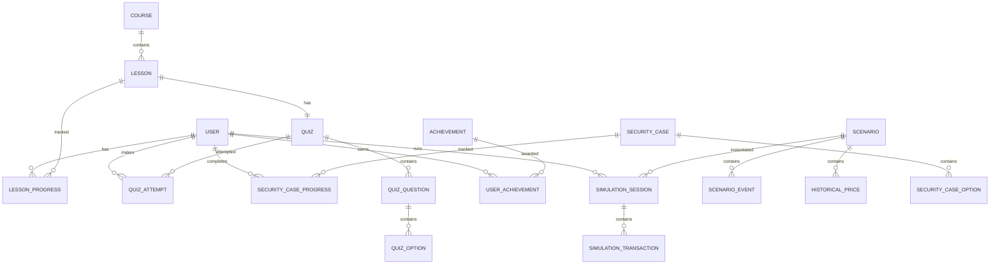

# Data Model / ERD — Crypto Education MVP

## 1. Подход

Модель разделена на:
1. пользовательские данные;
2. образовательный/редакционный контент;
3. Market Replay;
4. кеш текущего рынка.

Контент может физически храниться в БД или импортироваться из versioned JSON. API не должен зависеть от способа хранения.

## 2. ERD

## 3. User

| Поле | Тип | Ключ | Описание |
|---|---|---|---|
| id | UUID/BIGINT | PK | Внутренний ID |
| max_user_id | BIGINT/string | UNIQUE | MAX ID |
| display_name | varchar | | Имя/ник, если используется |
| avatar_url | varchar | | Опционально |
| last_opened_lesson_id | FK nullable | | Для «Продолжить обучение» |
| created_at | datetime | | Создание |
| last_seen_at | datetime | | Последний запуск |

Не хранить телефон, email и финансовые данные без отдельной продуктовой необходимости.

## 4. Course

- id PK
- slug UNIQUE
- title
- short_description
- display_order
- status

## 5. Lesson

- id PK
- course_id FK Course
- title
- short_description
- duration_minutes
- content_json JSON
- display_order
- status
- updated_at

`content_json` хранит LessonSection.

## 6. Quiz / Question / Option

### Quiz
- id PK
- lesson_id FK Lesson UNIQUE
- title

### QuizQuestion
- id PK
- quiz_id FK Quiz
- text
- type
- explanation
- display_order

### QuizOption
- id PK
- question_id FK QuizQuestion
- text
- is_correct
- display_order

## 7. LessonProgress

- user_id FK User
- lesson_id FK Lesson
- status: `NOT_STARTED / OPENED / COMPLETED`
- first_opened_at nullable
- completed_at nullable
- updated_at

**UNIQUE:** `(user_id, lesson_id)`.

## 8. QuizAttempt

- id PK
- user_id FK User
- quiz_id FK Quiz
- correct_answers
- total_questions
- score_percent
- answers_json JSON
- completed_at

## 9. SecurityCase

- id PK
- title
- short_description
- scenario_text
- context nullable
- red_flags_json JSON
- takeaway
- threat_ids_json JSON nullable
- display_order
- status

### SecurityCaseOption
- id PK
- security_case_id FK
- text
- safety_level: `SAFE / RISKY`
- feedback
- consequences nullable
- display_order

### SecurityCaseProgress
- user_id FK
- security_case_id FK
- attempts_count
- completed_at nullable
- last_option_id nullable

**UNIQUE:** `(user_id, security_case_id)`.

## 10. Threat

**P2.**
- id PK
- slug UNIQUE
- title
- content_json
- status

## 11. Scenario

- id PK
- title
- short_description
- start_date
- end_date
- estimated_minutes
- difficulty
- starting_balance_rub decimal
- benchmark_asset
- asset_symbols_json JSON
- speed_profile_json JSON
- analysis_rules_json JSON
- status

## 12. ScenarioEvent

- id PK
- scenario_id FK
- event_at
- title
- description
- context nullable
- category
- affected_assets_json
- source_name
- source_url
- learning_topic nullable
- display_order

**INDEX:** `(scenario_id, event_at)`.

## 13. HistoricalPrice

- id PK
- scenario_id FK
- asset_symbol
- price_at
- price_rub decimal
- source

**UNIQUE/INDEX:** `(scenario_id, asset_symbol, price_at)`.

Для больших datasets позже можно вынести цены в файловое/columnar-хранилище. Для хакатона таблица или versioned dataset достаточны.

## 14. SimulationSession

- id PK
- user_id FK
- scenario_id FK
- status: `ACTIVE / PAUSED / COMPLETED / INTERRUPTED`
- started_at
- completed_at nullable
- current_scenario_at
- starting_balance_rub
- cash_balance_rub
- portfolio_json JSON
- final_value_rub nullable
- return_percent nullable
- benchmark_return_percent nullable
- analysis_result_json nullable

Для MVP `portfolio_json` допустим ради скорости. Позже позиции можно нормализовать.

## 15. SimulationTransaction

- id PK
- session_id FK
- type: `BUY / SELL`
- asset_symbol
- quantity
- price_rub
- amount_rub
- scenario_at
- created_at
- related_event_id FK nullable

**INDEX:** `(session_id, scenario_at)`.

## 16. News

- id PK
- title
- preview
- category
- published_at
- what_happened
- why_important
- analysis
- takeaway
- source_name
- source_url
- disclaimer
- status

## 17. Achievement / UserAchievement

**P2.**

### Achievement
- id PK
- code UNIQUE
- title
- description
- icon
- trigger_type
- trigger_value

### UserAchievement
- user_id FK
- achievement_id FK
- awarded_at

**UNIQUE:** `(user_id, achievement_id)`.

## 18. MarketAssetCache

- symbol PK
- name
- price_rub
- change_24h_percent
- sparkline_json nullable
- source
- source_timestamp
- cached_at

Кеш не является учётом реальных пользовательских активов.

## 19. Ограничения целостности

1. Lesson относится к одному Course.
2. Один Lesson имеет максимум один Quiz в MVP.
3. Future ScenarioEvent/HistoricalPrice не возвращаются клиенту replay.
4. SimulationTransaction принадлежит одной SimulationSession.
5. SELL не превышает позицию.
6. BUY не превышает cash balance.
7. Завершённый LessonProgress не откатывается.
8. Один пользователь определяется уникальным `max_user_id`.
