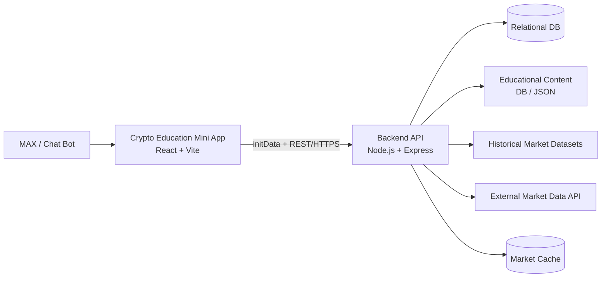
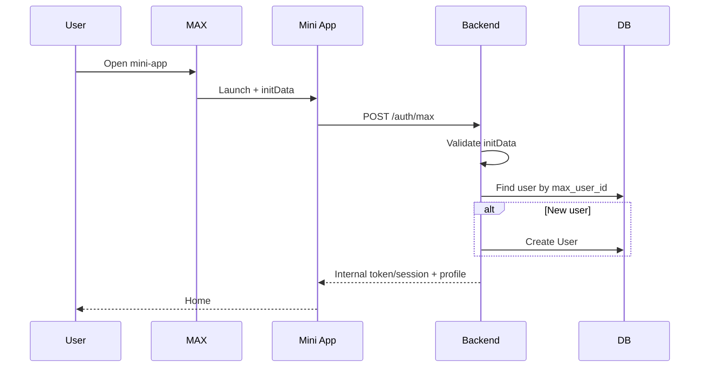
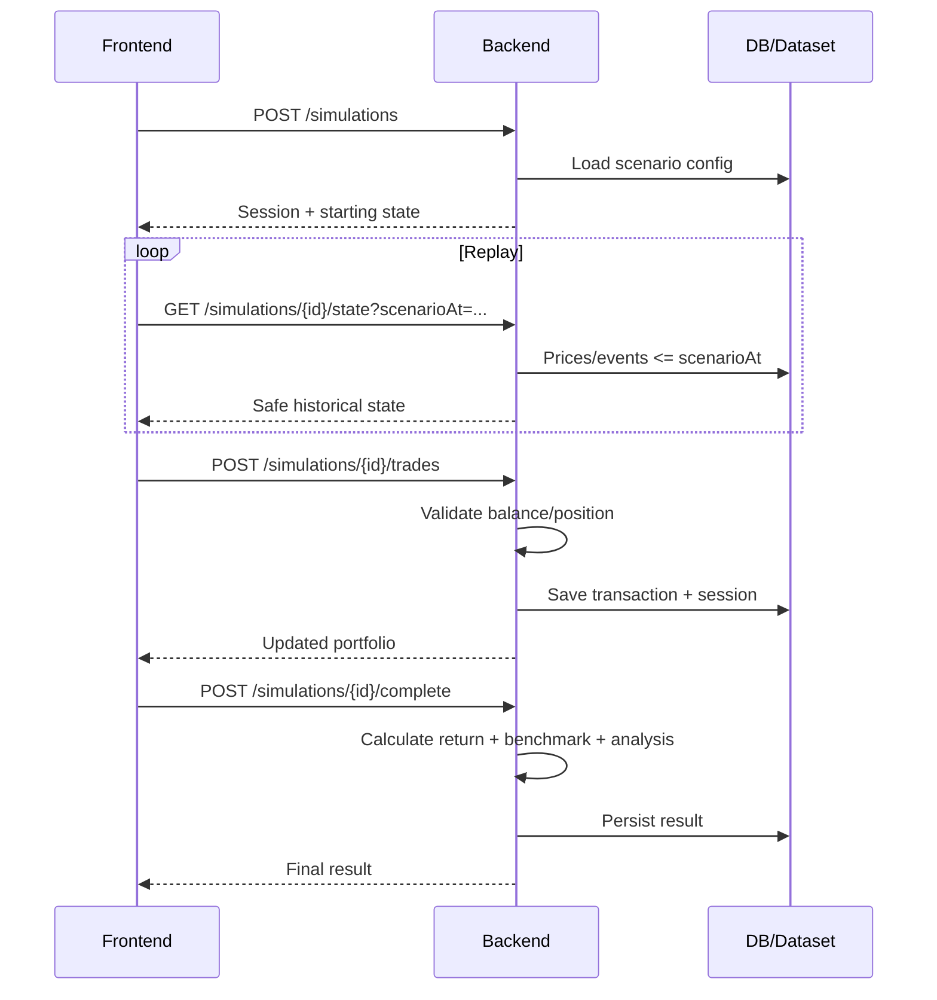
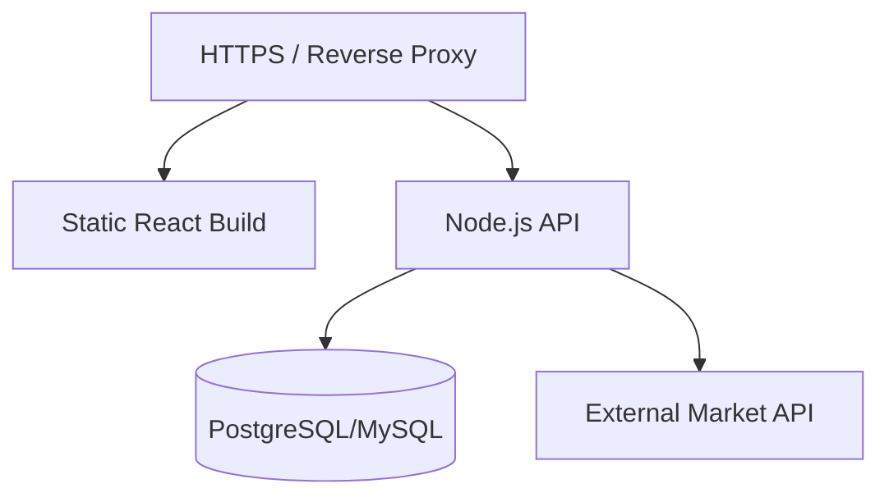

# System Architecture — Crypto Education MVP

## 1. Архитектурный принцип

Для хакатона используем простую схему:
- один frontend;
- один backend;
- одна реляционная БД;
- один внешний источник current market-data;
- статический/управляемый образовательный контент;
- заранее подготовленные historical datasets.

Микросервисы, брокеры сообщений и AI-контур не требуются.

## 2. High-Level Architecture

## 3. MAX

Отвечает за запуск mini-app и передачу launch-data/идентификатора пользователя. Отдельная регистрация внутри продукта отсутствует.

## 4. Frontend — React/Vite

Ответственность:
- UI и навигация;
- уроки/тесты;
- отображение Market Replay;
- визуальный таймер/анимация replay;
- графики;
- новости;
- профиль;
- крипто-робот.

Frontend не является доверенным источником для:
- MAX ID;
- quiz score;
- баланса;
- портфеля;
- completed result.

## 5. Backend — Node.js/Express

Ответственность:
- validation MAX initData;
- create/get User;
- content API;
- проверка тестов;
- progress;
- SimulationSession;
- BUY/SELL validation;
- portfolio calculation;
- выдача historical data только до текущего scenario time;
- benchmark;
- deterministic analysis;
- news;
- market-data proxy/cache.

## 6. Database

Хранит:
- User;
- progress;
- quiz attempts;
- security progress;
- simulation sessions/transactions;
- news;
- при выбранной реализации — content.

Для MVP допустим PostgreSQL или MySQL. Выбор фиксируется до миграций.

## 7. Educational Content

### Вариант A — БД
Плюсы: единый API, проще менять контент.

### Вариант B — versioned JSON
Плюсы: быстрее, не нужен CMS.

**Рекомендация MVP:** хранить контент как versioned JSON/seed и загружать backend/DB.

## 8. Historical Market Dataset

Historical prices и events готовятся заранее и не зависят от live API во время replay. Это обеспечивает воспроизводимость и устойчивость демо.

Dataset содержит:
- prices;
- events;
- source metadata;
- scenario config;
- benchmark config;
- analysis rules.

## 9. External Market Data API

Используется только в разделе «Крипторынок». Frontend обращается к своему backend, а не напрямую к провайдеру.

## 10. Cache

При сбое market provider:
1. возвращается последний кеш с `isStale=true`;
2. при отсутствии кеша — контролируемая ошибка.

## 11. Identification Flow

## 12. Market Replay Flow

## 13. Security Boundaries

Backend валидирует:
- MAX launch data;
- ownership пользователя;
- quiz submission;
- SimulationSession ownership;
- баланс;
- SELL quantity;
- assets allowed in scenario;
- scenario timestamp.

Frontend не получает заранее:
- correct quiz answers;
- future events;
- future prices;
- external API secrets.

## 14. Deployment MVP

Frontend/backend можно разместить в одном контейнерном окружении.

## 15. Намеренно отсутствует

- микросервисы;
- Kafka/RabbitMQ;
- LLM/vector DB;
- отдельный auth provider;
- payments/wallet infrastructure;
- CMS;
- обязательный WebSocket.

Market Replay можно реализовать через frontend timer + REST.

## 16. Решения до начала кодинга

1. PostgreSQL или MySQL.
2. JWT или server session после MAX validation.
3. Market-data provider.
4. Chart library.
5. Historical dataset: DB или versioned files.
6. Cache policy.
