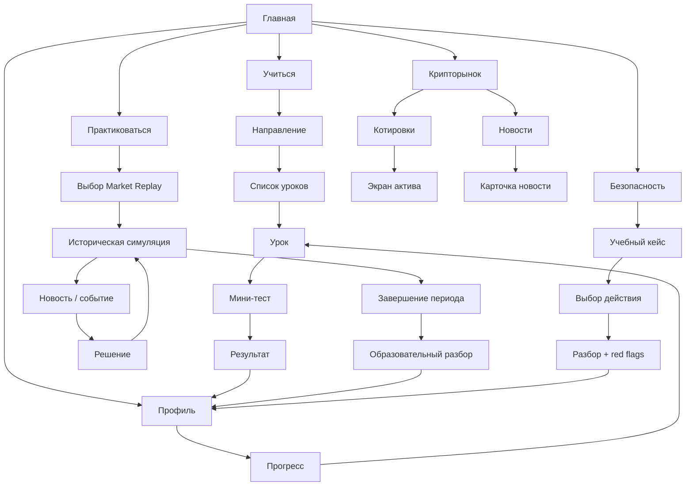
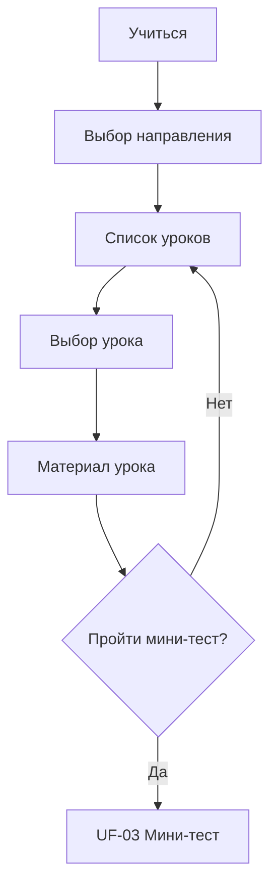
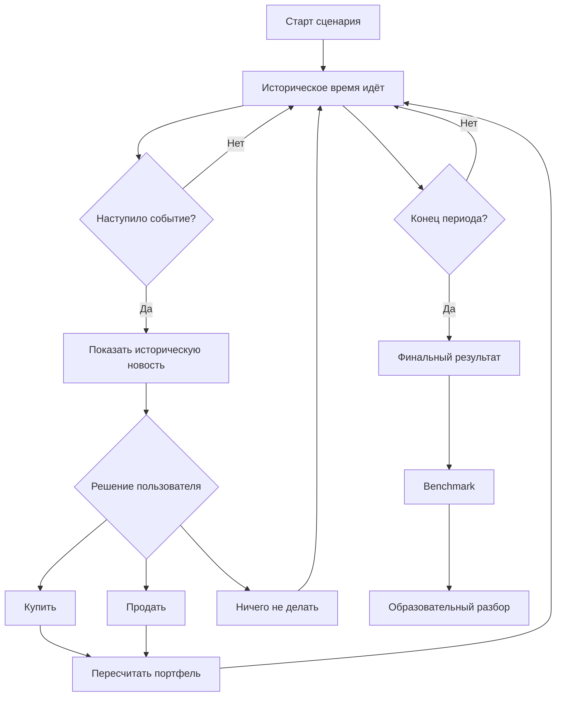
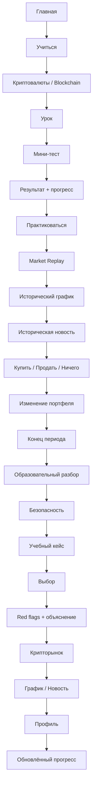

# User Flows — Crypto Education MVP

## 1. Назначение документа

Документ фиксирует основные пользовательские потоки Crypto Education в границах текущего MVP.

User Flows построены на основании:

- Product Vision;
- Feature Vision — Учиться;
- Feature Vision — Практиковаться / Historical Market Replay;
- Feature Vision — Безопасность;
- Feature Vision — Крипторынок;
- Feature Vision — Профиль;
- MVP Scope.

При расхождении между более широким Feature Vision и MVP Scope приоритет имеет **MVP Scope**.

---

# 2. Границы User Flows

В текущие User Flows включены:

1. вход на Главную и навигация;
2. обучение;
3. мини-тест;
4. исторический Market Replay;
5. покупка/продажа внутри Market Replay;
6. учебный кейс по безопасности;
7. база угроз — как дополнительная ветка;
8. крипторынок и график актива;
9. новости крипторынка;
10. профиль и возврат к обучению.

В текущих документах **не определены** сценарии регистрации, авторизации, onboarding и управления аккаунтом, поэтому они не включаются в данный артефакт.

---

# 3. Карта основных пользовательских потоков

---

# 4. UF-01 — Главная и переход в разделы

## Цель

Дать пользователю единый вход в продукт и быстрый доступ к ключевым функциям.

## Предусловия

- приложение открыто;
- пользователь находится на Главной.

## Основной поток

1. Пользователь открывает приложение.
2. Система отображает Главную.
3. Пользователь видит:
   - продолжение последнего урока;
   - общий прогресс;
   - быстрые переходы в основные разделы;
   - небольшой блок котировок;
   - последнюю новость;
   - крипто-робота с подготовленной подсказкой.
4. Пользователь выбирает необходимый раздел:
   - **Учиться**;
   - **Практиковаться**;
   - **Безопасность**;
   - **Крипторынок**;
   - **Профиль**.
5. Система открывает выбранный раздел.

## Альтернативный поток

### UF-01.A — Продолжить обучение

1. Пользователь нажимает **«Продолжить обучение»**.
2. Система открывает последний незавершённый урок.
3. Далее выполняется UF-02.

---

# 5. UF-02 — Изучение урока

## Цель

Позволить пользователю выбрать образовательное направление, изучить урок и перейти к проверке знаний.

## Предусловия

- пользователь открыл раздел **«Учиться»**.

## Основной поток

1. Система отображает четыре направления:
   - Криптовалюты;
   - Blockchain;
   - Финансовые основы;
   - Россия и право.
2. Для каждого направления отображается прогресс.
3. Пользователь выбирает направление.
4. Система открывает список уроков.
5. Пользователь выбирает любой урок.
6. Система открывает экран урока.
7. Пользователь изучает:
   - основной материал;
   - пример;
   - блок **«Главное запомнить»**;
   - при наличии блок **«Риски»**;
   - визуальный материал.
8. Пользователь нажимает **«Пройти мини-тест»**.
9. Система запускает UF-03.

## Бизнес-ветки

- Все направления доступны сразу.
- Все реализованные уроки доступны без предварительной разблокировки.
- Пользователь может вернуться к списку уроков без прохождения теста.
- Незавершённый урок не считается пройденным.

## Выход

- переход к мини-тесту;
- либо возврат к списку уроков.

---

# 6. UF-03 — Прохождение мини-теста

## Цель

Закрепить материал урока и обновить образовательный прогресс пользователя.

## Предусловия

- пользователь открыл мини-тест из урока.

## Основной поток

1. Система отображает первый вопрос.
2. Пользователь выбирает ответ.
3. Система фиксирует ответ.
4. При предусмотренной механике система показывает:
   - правильность ответа;
   - короткое пояснение.
5. Пользователь переходит к следующему вопросу.
6. Шаги повторяются до последнего вопроса.
7. Система рассчитывает итоговый результат.
8. Система отображает:
   - количество правильных ответов;
   - процент;
   - короткий результат;
   - подсказку крипто-робота.
9. Урок получает статус **«пройден»**.
10. Результат теста сохраняется.
11. Прогресс направления пересчитывается.
12. Пользователь выбирает:
   - следующий урок;
   - вернуться к курсу;
   - перейти в профиль.

## Альтернативный поток

### UF-03.A — Повторное прохождение

1. Пользователь открывает уже пройденный тест.
2. Запускает тест повторно.
3. Проходит вопросы.
4. Система сохраняет новый результат согласно правилу, которое будет окончательно определено на этапе FR:
   - последний результат;
   - либо лучший результат.

## Выход

- обновлённый прогресс обучения.

---

# 7. UF-04 — Выбор исторического Market Replay

## Цель

Запустить завершённую историческую симуляцию рынка.

## Предусловия

- пользователь открыл **«Практиковаться»**.

## Основной поток

1. Система отображает доступные исторические сценарии.
2. Для сценария показываются:
   - название;
   - исторический период;
   - длительность;
   - сложность;
   - доступные активы;
   - нейтральное описание без раскрытия будущего.
3. Пользователь выбирает сценарий.
4. Система показывает стартовые условия:
   - стартовый виртуальный капитал;
   - доступные активы;
   - предупреждение, что все средства виртуальные.
5. Пользователь нажимает **«Начать»**.
6. Создаётся новая сессия Market Replay.
7. Система открывает экран симуляции.
8. Запускается UF-05.

## MVP-приоритет

Целевая структура предусматривает 5 сценариев, но для хакатонного P0 должен полностью работать минимум **1 сценарий end-to-end**.

---

# 8. UF-05 — Прохождение Market Replay

## Цель

Позволить пользователю прожить исторический период, принимать решения и наблюдать их последствия без знания будущего.

## Предусловия

- создана сессия Market Replay;
- задан стартовый виртуальный капитал.

## Основной поток

1. Система показывает:
   - текущую историческую дату;
   - исторические котировки;
   - график только до текущей даты;
   - виртуальный портфель;
   - свободный баланс;
   - оставшееся время.
2. Историческое время движется в ускоренном режиме.
3. Система обновляет цены по историческому dataset.
4. При наступлении даты подготовленного события появляется новость.
5. Пользователь изучает событие.
6. Пользователь выбирает действие:
   - купить;
   - продать;
   - ничего не делать.
7. При покупке или продаже запускается UF-06.
8. После действия либо бездействия симуляция продолжается.
9. Шаги 2–8 повторяются до конца периода.
10. После достижения конечной даты симуляция останавливается.
11. Система рассчитывает:
   - финальную стоимость портфеля;
   - абсолютный результат;
   - доходность;
   - простой benchmark.
12. Система формирует детерминированный образовательный разбор.
13. Пользователь видит:
   - график капитала;
   - историю решений;
   - финансовый результат;
   - объяснение рисков его поведения.
14. Сессия получает статус **«завершена»**.
15. Результат сохраняется в профиль.

## Критическое бизнес-правило

Пользователь никогда не получает информацию из будущего:

- будущий участок графика скрыт;
- будущие события скрыты;
- будущие цены недоступны;
- интерфейс не сообщает, что актив позднее вырастет или упадёт.

## Пауза

1. Пользователь нажимает **Pause**.
2. Историческое время останавливается.
3. Пользователь может:
   - изучить новость;
   - посмотреть портфель;
   - совершить операцию.
4. Пользователь продолжает симуляцию.

---

# 9. UF-06 — Покупка / продажа в Market Replay

## Цель

Изменить виртуальный портфель по исторической цене текущего момента.

## 9.1. Покупка

1. Пользователь выбирает **«Купить»**.
2. Система отображает доступные активы.
3. Пользователь выбирает актив.
4. Указывает сумму.
5. Система показывает:
   - текущую историческую цену;
   - рассчитываемое количество актива;
   - доступный виртуальный баланс.
6. Пользователь подтверждает покупку.
7. Система проверяет достаточность баланса.
8. При достаточном балансе:
   - создаётся виртуальная операция;
   - свободный баланс уменьшается;
   - актив добавляется/увеличивается в портфеле;
   - операция добавляется в историю.
9. Пользователь возвращается в симуляцию.

### Недостаточно средств

1. Система обнаруживает, что сумма превышает свободный баланс.
2. Операция не выполняется.
3. Пользователь получает сообщение о недостаточности виртуальных средств.
4. Пользователь изменяет сумму или отменяет действие.

---

## 9.2. Продажа

1. Пользователь выбирает **«Продать»**.
2. Система показывает активы его портфеля.
3. Пользователь выбирает актив.
4. Указывает количество или долю.
5. Система проверяет доступное количество.
6. Пользователь подтверждает продажу.
7. Система:
   - создаёт виртуальную операцию;
   - уменьшает позицию;
   - увеличивает свободный баланс;
   - сохраняет операцию в истории.
8. Пользователь возвращается в симуляцию.

### Недостаточно актива

1. Пользователь пытается продать больше, чем есть в портфеле.
2. Система отклоняет операцию.
3. Пользователь корректирует количество.

---

# 10. UF-07 — Учебный кейс по безопасности

## Цель

Научить пользователя распознавать риск в конкретной ситуации и принимать безопасное решение.

## Предусловия

- пользователь открыл раздел **«Безопасность»**.

## Основной поток

1. Система показывает список учебных кейсов.
2. Пользователь выбирает кейс.
3. Система показывает:
   - ситуацию;
   - контекст;
   - 2–4 варианта действий.
4. Пользователь выбирает действие.
5. Система показывает:
   - безопасный или рискованный выбор;
   - объяснение;
   - red flags;
   - потенциальные последствия;
   - блок **«Что нужно запомнить»**.
6. Кейс получает статус **«пройден»**.
7. Прогресс пользователя обновляется.
8. Пользователь выбирает:
   - следующий кейс;
   - вернуться в «Безопасность»;
   - открыть связанную карточку угрозы.

## Повторное прохождение

- пользователь может повторно открыть и пройти кейс;
- объяснение показывается после каждого завершённого выбора.

## MVP

Для полноценного хакатонного build предусматривается минимум 3 интерактивных кейса.

---

# 11. UF-08 — Просмотр базы угроз

## Приоритет

**P2 / сокращаемая ветка.**

При нехватке времени отдельная большая база угроз может быть исключена, а необходимые объяснения останутся внутри учебных кейсов.

## Основной поток

1. Пользователь открывает **«База угроз»**.
2. Видит список типов угроз.
3. Выбирает угрозу.
4. Система показывает:
   - что это;
   - как работает;
   - признаки;
   - пример;
   - как защититься;
   - что нельзя делать.
5. Пользователь возвращается к списку или открывает другой материал.

---

# 12. UF-09 — Просмотр крипторынка

## Цель

Дать пользователю образовательный обзор текущих или подготовленных рыночных данных без возможности реальной торговли.

## Предусловия

- пользователь открыл **«Крипторынок»**.

## Основной поток

1. Система открывает вкладку **«Котировки»**.
2. Отображается фиксированный список 3–5 активов.
3. Для каждого показываются:
   - название;
   - тикер;
   - текущая цена;
   - изменение;
   - мини-график.
4. Пользователь выбирает актив.
5. Система открывает детальный экран.
6. Пользователь видит:
   - цену;
   - изменение;
   - график;
   - доступный период графика;
   - источник данных.
7. Пользователь возвращается к списку или переходит в новости.

## Альтернативные состояния

### UF-09.A — Данные загружаются

- система показывает состояние загрузки.

### UF-09.B — Рыночные данные недоступны

1. Внешний источник не вернул данные.
2. Система показывает состояние **«Данные временно недоступны»**.
3. Реальная торговля или альтернативные финансовые действия не предлагаются.

## P2-ветка — сравнение площадок

Если реализовано несколько источников:

1. Пользователь открывает сравнение.
2. Видит котировки одного актива из нескольких источников.
3. Система поясняет, что цены могут различаться.

В минимальном хакатонном build этот шаг может отсутствовать.

---

# 13. UF-10 — Просмотр новости крипторынка

## Цель

Дать пользователю короткий проверенный образовательный разбор значимого события.

## Основной поток

1. Пользователь открывает вкладку **«Новости»**.
2. Система показывает вручную подготовленный список материалов.
3. Пользователь выбирает новость.
4. Система показывает:
   - заголовок;
   - дату;
   - категорию;
   - «Что произошло?»;
   - «Почему это важно?»;
   - короткий разбор;
   - «Что нужно запомнить?»;
   - источник;
   - дисклеймер об отсутствии инвестиционной рекомендации.
5. Пользователь при необходимости переходит к первоисточнику.
6. Пользователь возвращается к списку.

## Состояния

- список загружен;
- список пуст;
- ошибка загрузки.

---

# 14. UF-11 — Профиль и прогресс

## Цель

Показать пользователю результаты его образовательного пути и позволить быстро продолжить обучение.

## Предусловия

- пользователь открыл **«Профиль»**.

## Основной поток

1. Система показывает:
   - nickname/идентификатор;
   - общий прогресс;
   - количество завершённых уроков;
   - результаты мини-тестов;
   - количество пройденных кейсов;
   - завершённые Market Replay.
2. Пользователь просматривает прогресс по направлениям.
3. Пользователь выбирает незавершённый или последний урок.
4. Система открывает соответствующий урок.
5. Далее выполняется UF-02.

## Дополнительная P2-ветка — достижения

Если достижения остаются в build:

1. Пользователь видит список полученных и ещё не полученных достижений.
2. Открывает достижение.
3. Система показывает условие его получения.

Достижения не влияют на доступ к функциям.

---

# 15. Сквозной Hackathon Demo Flow

Это основной поток, который должен быть полностью стабилен к защите.

### Demo Flow считается готовым, если:

1. все переходы выполняются без ручного вмешательства;
2. после теста сохраняется прогресс;
3. Market Replay проходит от старта до итогового разбора;
4. виртуальная операция корректно меняет портфель;
5. будущие данные Market Replay скрыты;
6. учебный кейс безопасности выдаёт корректный разбор;
7. крипторынок показывает данные или корректное fallback-состояние;
8. профиль отражает выполненные действия.

---

# 16. Матрица User Flow → Приоритет MVP

| ID | User Flow | Приоритет |
|---|---|---|
| UF-01 | Главная и навигация | P0 |
| UF-02 | Изучение урока | P0 |
| UF-03 | Мини-тест | P0 |
| UF-04 | Выбор Market Replay | P0 |
| UF-05 | Прохождение Market Replay | P0 |
| UF-06 | Покупка / продажа | P0 |
| UF-07 | Учебный кейс безопасности | P1 |
| UF-08 | База угроз | P2 |
| UF-09 | Крипторынок / котировки | P1 |
| UF-10 | Новости крипторынка | P1 |
| UF-11 | Профиль / прогресс | P0 |
| UF-11.A | Достижения | P2 |

---

# 17. Вопросы, которые User Flows намеренно не решают

Следующие вопросы не зафиксированы в текущих исходных документах и должны быть определены на следующих этапах:

- каким образом идентифицируется пользователь MAX;
- требуется ли отдельная авторизация;
- где именно хранится прогресс;
- сохраняется лучший или последний результат повторного теста;
- можно ли прервать Market Replay и продолжить позже;
- что происходит при закрытии mini-app во время активной симуляции;
- точный механизм обновления текущих котировок;
- точный состав активов для каждого исторического сценария;
- конкретные даты и verified events пяти исторических сценариев.

Эти решения должны быть зафиксированы в Functional Requirements, Business Rules и технической архитектуре, а не предполагаться внутри User Flows.
